# Investigating-with-Splunk

I uncovered several key details while investigating with Splunk on TryHackMe. I discovered that the adversary successfully created a backdoor user on one of the infected hosts and identified the registry key that was updated. I also determined the user the adversary was attempting to impersonate and found the command used to add the backdoor user from a remote computer. By analyzing the logs, I checked for any login attempts made by the backdoor user and identified the infected host where suspicious PowerShell commands were executed. Additionally, I determined the number of events logged for the malicious PowerShell execution and used CyberChef to decode the encoded PowerShell script, revealing the full URL involved in the attack.

## Task1-1
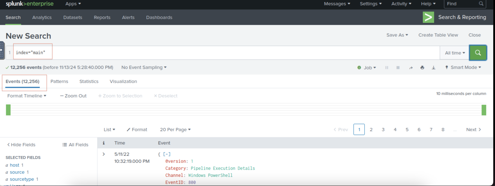

## Task1-2
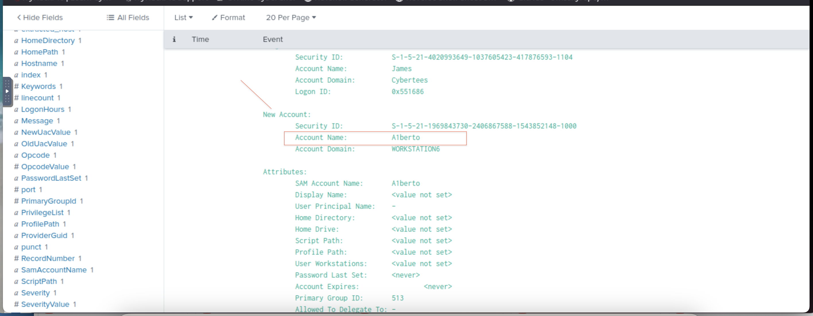

## Task1-3
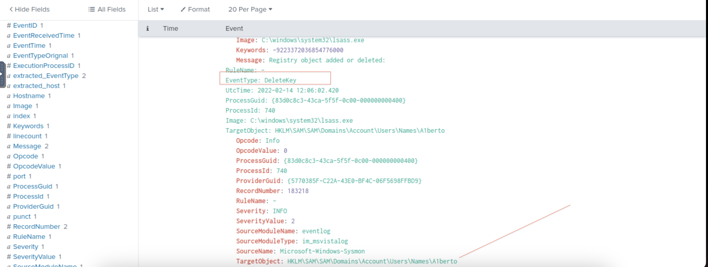

## Task1-4
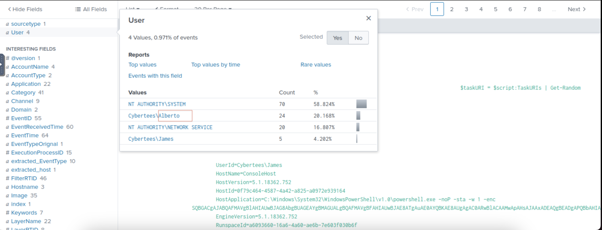

## Task1-5
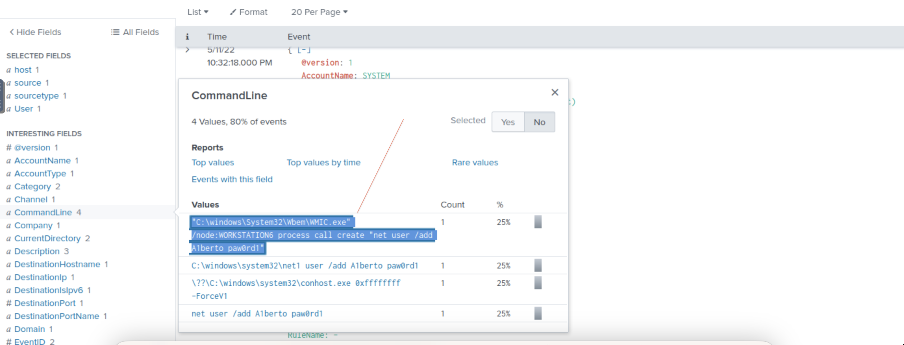

## Task1-6
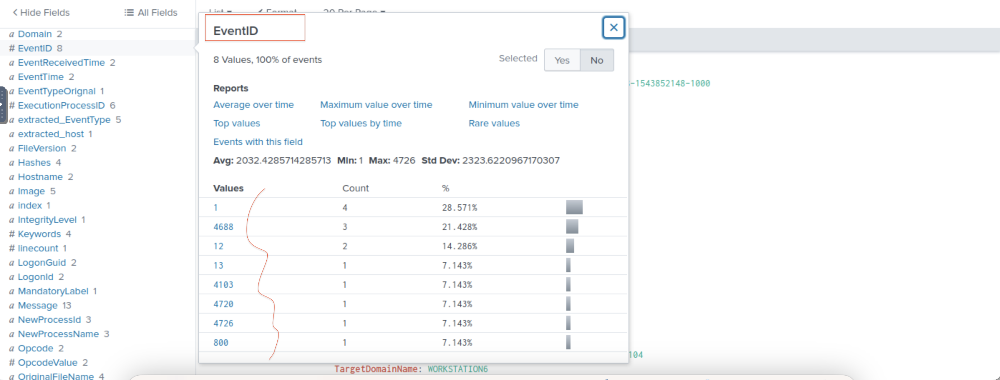

## Task1-7
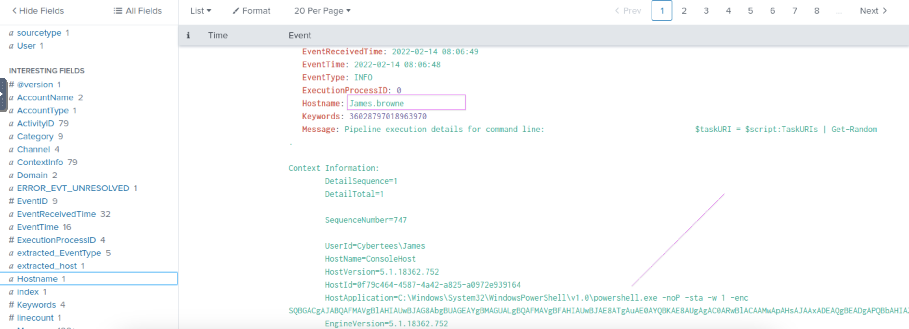

## Task1-8
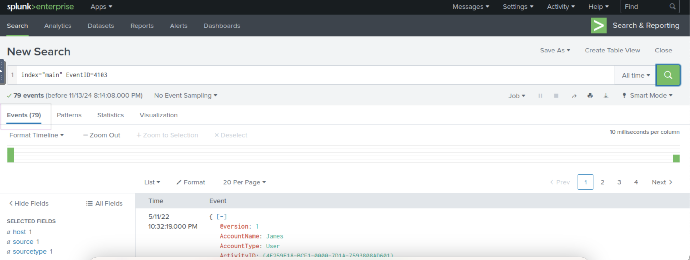

## Task1-9a
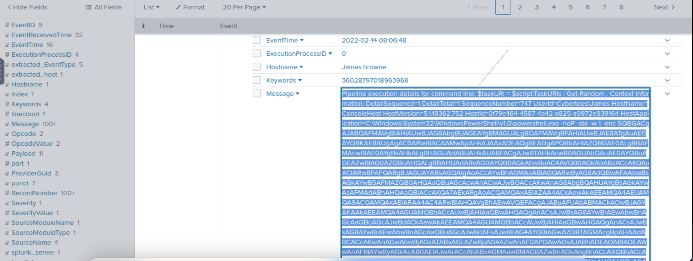

## Task1-9b
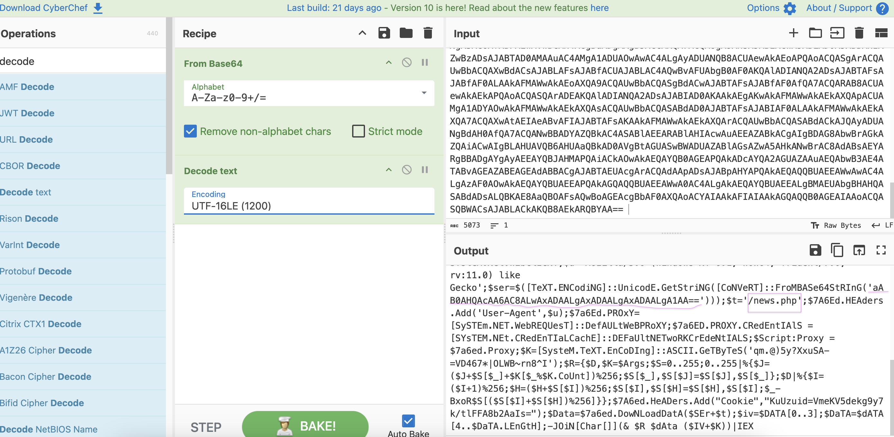

## Task1-9c
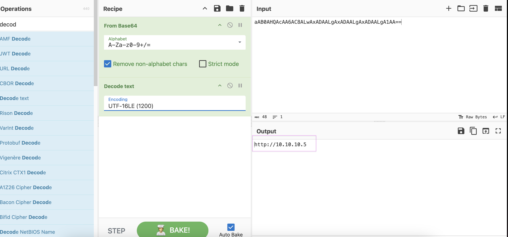

## Task1-9d
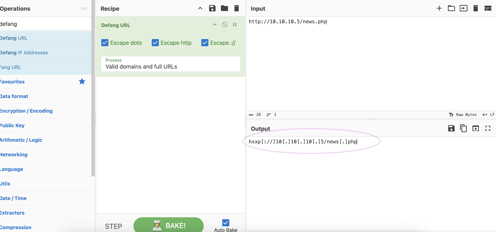

## Task1-9 Part-1 Correct Answer
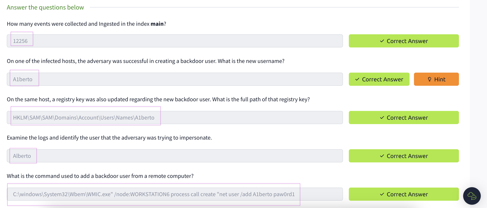

## Task1-9 Part-2 Correct Answer

## All Task Completed
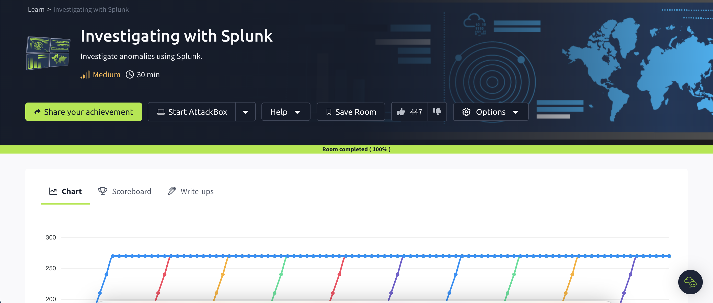
